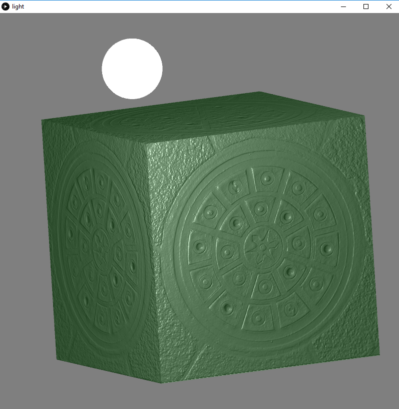

# Taller de shaders

## Propósito

Estudiar los [patrones de diseño de shaders](http://visualcomputing.github.io/Shaders/#/4).

## Tarea

1. Hacer un _benchmark_ entre la implementación por software y la de shaders de varias máscaras de convolución aplicadas a imágenes y video.
2. Implementar un modelo de iluminación que combine luz ambiental con varias fuentes puntuales de luz especular y difusa. Tener presente _factores de atenuación_ para las fuentes de iluminación puntuales.
3. (grupos de dos o más) Implementar el [bump mapping](https://en.wikipedia.org/wiki/Bump_mapping).

## Integrantes

Complete la tabla:

| Integrante                       | github nick   |
|----------------------------------|---------------|
| Luis Fernando Castro Peralta     | Moimolcp      |
| Wilson Andres Piravaguen Serrano | wapiravaguens |

## Informe

1. Para la realización del benchmark se escribió un fragment shader el cual permite realizar las distintas operaciones de convolución usando la GPU, con los botones definidos en la interfaz se puede cambiar entre las diferentes máscaras, además de cambiar entre video e imagen, el botón de “Hardware” y “Software” permite activar o desactivar el uso del shader, el rendimiento puede ser observado en pantalla en todo momento, y se calcula utilizando la variable de Processing `frameRate`, a partir de este valor se calcula el porcentaje al que está corriendo el programa en cada momento a partir de un frameRate base de 60 frames.
Los resultados que se obtuvieron fue un rendimiento de 37.5% por software y un 99% por hardware.

2. Para el modelo de iluminación se hizo usó la librería `nub` para proveer de interacción al programa, cada luz se define como un `Node` lo cual nos permite moverla fácilmente a través de la escena, cada luz se representada como una esfera del color correspondiente a la luz que emite, cada luz tiene un componente difuso y especular, además de un factor de atenuación que depende de la distancia, se pueden agregar o quitar luces usando las teclas “w” y “s” respectivamente, también se tiene un componente de luz ambiental el cual es combinado con el componente difuso y especular de las demás luces para lograr el resultado final.

3. La implementación del bump mapping se hizo en conjunto con la implementación de luces, se utilizó la variante “normal mapping” en la cual las normales de la superficie a renderizar se envían a través de una textura la cual tiene codificada en el color de cada pixel dicha normal, para pasar de color a el vector normal se usó la siguiente fórmula (rgb*2.0 - 1.0), dado que esta normal no está en el espacio del “ojo” si no en el espacio tangente a la superficie, los vectores de dirección de la luz y la cámara tienen que ser llevados a este espacio para poder operarlos correctamente, esta transformación se hace a través de una matriz llamada TBN( tangente, bitangente, normal), la cual se define así para una superficie con normal N, tangente T y bitangente B:

Aun cuando es una aproximación simple ya que la forma real de la superficie no cambia, si no lo que cambia es cómo interactúa con la luz, se logran buenos resultados

## Entrega

Fecha límite ~~Lunes 1/7/19~~ Domingo 7/7/19 a las 24h. Sustentaciones: 10/7/19 y 11/7/19.
